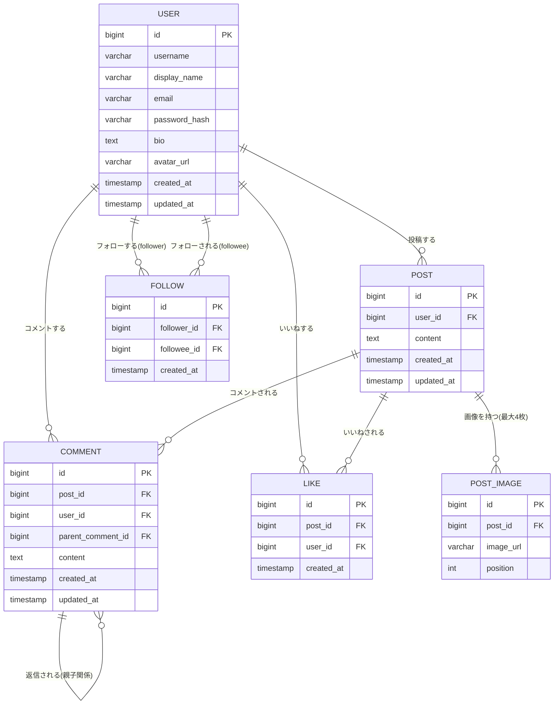

# Murmur 基本設計書

## 目次

- [1. 技術スタック](#1-技術スタック)
  - [1.1 バックエンド](#11-バックエンド)
  - [1.2 フロントエンド](#12-フロントエンド)
  - [1.3 データベース](#13-データベース)
  - [1.4 画像ストレージ](#14-画像ストレージ)
  - [1.5 インフラ方針（概要）](#15-インフラ方針概要)
- [2. アーキテクチャ方針](#2-アーキテクチャ方針)
- [3. DB物理設計](#3-db物理設計)
  - [3.1 ER図（確定）](#31-er図確定)
  - [3.2 テーブル定義](#32-テーブル定義)
- [4. API設計（案）](#4-api設計案)
  - [4.2 認証系エンドポイント詳細（確定）](#42-認証系エンドポイント詳細確定)
- [5. ディレクトリ構成（案）](#5-ディレクトリ構成案)
- [6. 今後詳細化する項目](#6-今後詳細化する項目)

---

## 1. 技術スタック

[要件定義書](requirements.md)を踏まえ、[TaskManagement](../../TaskManagement/docs/basic-design.md)プロジェクトと版数を揃えた構成とする。

### 1.1 バックエンド

| 項目 | 選定 | 選定理由 |
|------|------|----------|
| 言語／ランタイム | Java 25（LTS） | TaskManagementと同一。長期サポート版で学習・保守の両面で安定している |
| フレームワーク | Spring Boot 4.1.x | Java/Springのデファクトスタンダード。DI・自動設定により最小構成でREST APIを構築できる |
| ビルドツール | Gradle（Groovy DSL） | 指定 |
| Web | Spring Web（REST API, JSON） | フロントエンド（React）とはREST + JSONで疎結合に連携する |
| 認証 | Spring Security + JWT（アクセストークン）+ リフレッシュトークン | サインアップ/ログインを備えた複数ユーザー運用のため、トークンベースの認証を採用。ステートレス（`SessionCreationPolicy.STATELESS`）に構成しつつ、失効可能な長命リフレッシュトークン（DB管理、httpOnly Cookie配布）で短命なアクセストークンを再発行する（詳細は4.2章参照） |
| ORM／永続化 | MyBatis（XMLマッパー） | SQLを明示的に書いて実行内容を把握しやすく、学習目的でSQLへの理解を深めやすいため採用。JPA/Hibernateのような自動SQL生成は行わない |
| マイグレーション | Flyway | スキーマ変更をバージョン管理する |
| バリデーション | spring-boot-starter-validation | 投稿本文の文字数上限・画像枚数上限など入力チェックを宣言的に実装できる |
| API仕様書 | springdoc-openapi（Swagger UI） | フロントエンドと分離開発する際に、API仕様をブラウザから確認・試行できる |
| ボイラープレート削減 | Lombok（任意） | Getter/Setter等の定型コードを削減 |
| テスト | JUnit 5, Spring Boot Test, Testcontainers | 本物のPostgreSQLに対する統合テストを行う |

### 1.2 フロントエンド

| 項目 | 選定 | 選定理由 |
|------|------|----------|
| ビルドツール／言語 | Vite + TypeScript 6.x | TaskManagementと同一版数に揃える |
| パッケージマネージャ | npm | 追加ツール不要で最も標準的 |
| HTTPクライアント | axios | インターセプターやエラーハンドリングの記述が簡潔 |
| サーバー状態管理 | TanStack Query（React Query） v5系 | タイムライン・コメント・いいね等のデータ取得・キャッシュ・再取得をシンプルに扱える |
| スタイリング | Tailwind CSS v4系 | TaskManagementと同一 |
| Lint/Format | ESLint（typescript-eslint含む） + Prettier | コード品質・フォーマットの統一 |

### 1.3 データベース

| 項目 | 選定 | 選定理由 |
|------|------|----------|
| データベース | PostgreSQL | 指定。学習課題としても実務でも広く使われるRDBMS |
| ローカル起動方法 | Docker Compose | ローカル環境を汚さずPostgreSQLを起動・破棄できる |
| 環境切り替え | Spring Profiles（dev/prod）+ application.yml | 開発・本番でDB接続情報等を切り替える標準的な方法 |

### 1.4 画像ストレージ

投稿画像（1投稿最大4枚）は、クラウドのオブジェクトストレージサービス（S3のようなもの）に保存する方針とする。
実際にAWS S3を使用するかは未確定のため、本書では「クラウドオブジェクトストレージ」という抽象度で扱い、
バックエンドはストレージへの保存先パス（`image_url`）のみをDBに持つ設計とする。これにより、具体的な
プロバイダが確定した場合もアプリケーション側の変更を最小限に抑えられる。

アップロード方式（バックエンド経由でアップロードするか、署名付きURLでフロントエンドから直接アップロードするか）・
利用するプロバイダ・費用面の検討は[6章](#6-今後詳細化する項目)で扱う。

### 1.5 インフラ方針（概要）

本番運用ではロードバランサーを介した構成を想定している。具体的な構成要素（クラウドプロバイダ、
ロードバランサーの種類、EC2/RDS等のリソース、Terraformコード）は`docs/infrastructure.md`として
別セッションで検討する（TaskManagement/HouseholdBudgetと同様の位置付け）。本書では言及に留める。

## 2. アーキテクチャ方針

- React（SPA）とSpring Boot（REST API）をクライアント/サーバーで分離する構成とする
- フロントエンドとバックエンドはREST + JSONで通信し、認証にはトークン（JWT想定）を用いる
- 画像はアプリケーションサーバーを経由せず、クラウドオブジェクトストレージへ直接アップロード／そこから直接配信する構成を目指す（詳細は今後確定）
- 本番はロードバランサーの配下にアプリケーションサーバーを配置する構成を想定する

## 3. DB物理設計

[要件定義書 6章](requirements.md#6-データ項目案)のデータ項目を踏まえたテーブル定義。

### 3.1 ER図（確定）



### 3.2 テーブル定義

#### users

| カラム | 型 | 制約 | 備考 |
|--------|----|----|------|
| id | BIGINT | PRIMARY KEY, GENERATED ALWAYS AS IDENTITY | 自動採番 |
| username | VARCHAR(50) | NOT NULL, UNIQUE | ログイン・検索・URL等に使うユーザー名 |
| display_name | VARCHAR(50) | NOT NULL | 表示名 |
| email | VARCHAR(255) | NOT NULL, UNIQUE | メールアドレス |
| password_hash | VARCHAR(255) | NOT NULL | ハッシュ化したパスワード |
| bio | TEXT | | 自己紹介 |
| avatar_url | VARCHAR(500) | | アイコン画像URL（クラウドオブジェクトストレージ上のパス） |
| created_at | TIMESTAMP | NOT NULL, DEFAULT now() | 作成日時 |
| updated_at | TIMESTAMP | NOT NULL, DEFAULT now() | 更新日時 |

#### posts

| カラム | 型 | 制約 | 備考 |
|--------|----|----|------|
| id | BIGINT | PRIMARY KEY, GENERATED ALWAYS AS IDENTITY | 自動採番 |
| user_id | BIGINT | NOT NULL, REFERENCES users(id) | 投稿者 |
| content | VARCHAR(280) | NOT NULL | 投稿本文（文字数上限は要件定義書で確定） |
| created_at | TIMESTAMP | NOT NULL, DEFAULT now() | 作成日時 |
| updated_at | TIMESTAMP | NOT NULL, DEFAULT now() | 更新日時（編集時に更新） |

#### post_images

| カラム | 型 | 制約 | 備考 |
|--------|----|----|------|
| id | BIGINT | PRIMARY KEY, GENERATED ALWAYS AS IDENTITY | 自動採番 |
| post_id | BIGINT | NOT NULL, REFERENCES posts(id) | 紐づく投稿 |
| image_url | VARCHAR(500) | NOT NULL | クラウドオブジェクトストレージ上の画像パス |
| position | SMALLINT | NOT NULL, CHECK (0〜3) | 投稿内での表示順（1投稿最大4枚） |

#### comments

| カラム | 型 | 制約 | 備考 |
|--------|----|----|------|
| id | BIGINT | PRIMARY KEY, GENERATED ALWAYS AS IDENTITY | 自動採番 |
| post_id | BIGINT | NOT NULL, REFERENCES posts(id) | 紐づく投稿 |
| user_id | BIGINT | NOT NULL, REFERENCES users(id) | コメントしたユーザー |
| parent_comment_id | BIGINT | REFERENCES comments(id) | 返信先コメント（自己参照。トップレベルはNULL） |
| content | VARCHAR(280) | NOT NULL | コメント本文 |
| created_at | TIMESTAMP | NOT NULL, DEFAULT now() | 作成日時 |
| updated_at | TIMESTAMP | NOT NULL, DEFAULT now() | 更新日時 |
| deleted_at | TIMESTAMP | | 論理削除日時（削除済みの場合のみ設定。返信を持つコメントも物理削除せず本文のみ非表示にする） |

#### likes

| カラム | 型 | 制約 | 備考 |
|--------|----|----|------|
| id | BIGINT | PRIMARY KEY, GENERATED ALWAYS AS IDENTITY | 自動採番 |
| post_id | BIGINT | NOT NULL, REFERENCES posts(id) | 対象の投稿 |
| user_id | BIGINT | NOT NULL, REFERENCES users(id) | いいねしたユーザー |
| created_at | TIMESTAMP | NOT NULL, DEFAULT now() | いいねした日時 |
| | | UNIQUE (post_id, user_id) | 同一ユーザーが同一投稿に重複していいねできないようにする |

#### follows

| カラム | 型 | 制約 | 備考 |
|--------|----|----|------|
| id | BIGINT | PRIMARY KEY, GENERATED ALWAYS AS IDENTITY | 自動採番 |
| follower_id | BIGINT | NOT NULL, REFERENCES users(id) | フォローする側 |
| followee_id | BIGINT | NOT NULL, REFERENCES users(id) | フォローされる側 |
| created_at | TIMESTAMP | NOT NULL, DEFAULT now() | フォローした日時 |
| | | UNIQUE (follower_id, followee_id), CHECK (follower_id <> followee_id) | 重複フォロー・自己フォローを防ぐ |

インデックスは主キーの他、`posts.user_id`（タイムライン取得）、`comments.post_id`（コメントスレッド取得）、
`follows.follower_id`（フォロー中一覧取得）への付与を想定する。

## 4. API設計（案）

ベースURL: `http://localhost:8080/api`

### 4.1 エンドポイント一覧

| メソッド | パス | 概要 |
|---------|------|------|
| POST | `/auth/signup` | サインアップ |
| POST | `/auth/login` | ログイン（アクセストークン発行、リフレッシュトークンをhttpOnly Cookieで発行） |
| POST | `/auth/refresh` | リフレッシュトークン（Cookie）からアクセストークンを再発行（ローテーション） |
| POST | `/auth/logout` | ログアウト（リフレッシュトークンをサーバー側で失効） |
| GET | `/users/{username}` | プロフィール取得 |
| PUT | `/users/{id}` | プロフィール編集（表示名・自己紹介・アイコン画像） |
| GET | `/users/search?q=` | ユーザー検索（ユーザー名・表示名） |
| POST | `/users/{id}/follow` | フォローする |
| DELETE | `/users/{id}/follow` | フォロー解除する |
| GET | `/users/{id}/following` | フォロー中一覧 |
| GET | `/users/{id}/followers` | フォロワー一覧 |
| GET | `/timeline?scope=following\|all` | タイムライン取得。`scope=following`（既定）はフォロー中ユーザー＋自分の投稿、`scope=all`は全ユーザーの投稿 |
| GET | `/posts/{id}` | 投稿詳細取得（画像・コメント数・いいね数含む） |
| POST | `/posts` | 投稿作成（本文＋画像最大4枚） |
| PUT | `/posts/{id}` | 投稿編集 |
| DELETE | `/posts/{id}` | 投稿削除 |
| GET | `/posts/{id}/comments` | コメント一覧取得（時系列フラット、reply_to参照付き。階層ネスト構造ではない） |
| POST | `/posts/{id}/comments` | コメント・返信の作成（`parentCommentId`で返信先を指定） |
| PUT | `/comments/{id}` | コメント編集 |
| DELETE | `/comments/{id}` | コメント削除（論理削除） |
| GET | `/comments/search?q=` | コメント検索（本文キーワード） |
| POST | `/posts/{id}/like` | いいねする |
| DELETE | `/posts/{id}/like` | いいね解除する |

各エンドポイントのリクエスト/レスポンス詳細（フィールド定義・バリデーションルール・エラーレスポンス）は、
実装着手時にこの節へ追記する。API仕様書はspringdoc-openapi（Swagger UI）で自動生成する
（TaskManagementと同様、`http://localhost:8080/swagger-ui.html`）。

### 4.2 認証系エンドポイント詳細（確定）

アクセストークン（JWT、有効期限900秒=15分）とリフレッシュトークン（ランダムなUUID文字列、有効期限14日）の
2種類を発行する。アクセストークンはフロントエンドがメモリ上に保持し`Authorization: Bearer <token>`ヘッダーで
送信する。リフレッシュトークンはSHA-256でハッシュ化して`refresh_tokens`テーブルに保存し、生の値は
`httpOnly` + `SameSite=Lax`のCookie（`refresh_token`、`Path=/api/auth`）としてのみブラウザに渡す（JSからは
読み取れない）。アクセストークンが失効したら`/auth/refresh`でCookieを使って再発行する。再発行のたびに
リフレッシュトークンもローテーション（古いトークンは失効させ新しいトークンを発行）し、使い回しを防ぐ。
`/auth/logout`はCookieのリフレッシュトークンをDB上で失効させ、Cookie自体も削除する。

**POST /auth/signup**

- Request: `{ "username": string, "displayName": string, "email": string, "password": string }`
- Response 201: `{ "id": number, "username": string, "displayName": string, "email": string, "createdAt": string }`
- Errors: 400（バリデーション）, 409（username/email重複）

**POST /auth/login**

- Request: `{ "email": string, "password": string }`
- Response 200: `{ "token": string, "tokenType": "Bearer", "expiresInSeconds": number, "user": { "id": number, "username": string, "displayName": string, "email": string } }`
- レスポンスヘッダー: `Set-Cookie: refresh_token=...; HttpOnly; SameSite=Lax; Path=/api/auth`
- Errors: 401（認証失敗）

**POST /auth/refresh**

- Request: なし（`refresh_token` Cookieのみ）
- Response 200: `{ "token": string, "tokenType": "Bearer", "expiresInSeconds": number }`
- レスポンスヘッダー: ローテーションされた新しい`refresh_token` Cookie
- Errors: 401（Cookieなし・期限切れ・失効済み・再利用検知）

**POST /auth/logout**

- Request: なし（`refresh_token` Cookieがあれば失効させる）
- Response 200: `{ "message": "logged out" }`
- レスポンスヘッダー: `refresh_token` Cookieを削除（`Max-Age=0`）

**GET /users/me**（JWT動作確認用に追加したエンドポイント）

- Authorizationヘッダー必須
- Response 200: `{ "id": number, "username": string, "displayName": string, "email": string }`
- Errors: 401（トークンなし/不正）

## 5. ディレクトリ構成（案）

### 5.1 バックエンド（`backend/`）

```
backend/src/main/java/com/example/murmur/
├── MurmurApplication.java   # エントリポイント
├── config/                  # CORS・Security（JWT）等の共通設定
├── auth/                    # サインアップ・ログイン
├── user/                    # ユーザー・フォロー・検索
├── post/                    # 投稿・画像・タイムライン
├── comment/                 # コメント（時系列フラット+reply_to参照）・検索
└── like/                    # いいね
backend/src/main/resources/
├── application.yml
└── db/migration/            # Flywayマイグレーション
```

TaskManagementと同様、機能単位（package-by-feature）でパッケージを分割する構成とする。

### 5.2 フロントエンド（`frontend/`）

```
frontend/src/
├── main.tsx
├── App.tsx
├── components/
│   ├── Timeline.tsx
│   ├── PostCard.tsx
│   ├── PostFormModal.tsx          # 投稿作成・編集共通モーダル
│   ├── PostDetailPage.tsx
│   ├── CommentList.tsx            # 時系列フラット表示（reply_toで返信先を表示）
│   ├── CommentItem.tsx
│   ├── CommentForm.tsx
│   ├── Profile.tsx
│   ├── FollowList.tsx
│   └── Search.tsx
├── hooks/                          # TanStack Queryによるフック
├── api/
│   ├── client.ts
│   ├── posts.ts / comments.ts / users.ts / auth.ts
└── types/
```

## 6. 今後詳細化する項目

- 画像ストレージの具体プロバイダ（AWS S3か他のクラウドオブジェクトストレージか）の選定と、アップロード方式（バックエンド経由 or 署名付きURL）の確定
- API設計（4章）のうち、認証系以外のエンドポイント（users/posts/comments/likes等）のリクエスト/レスポンス詳細の確定
- `docs/infrastructure.md`（ロードバランサーを含むインフラ構成、AWS/Terraform等）の作成
