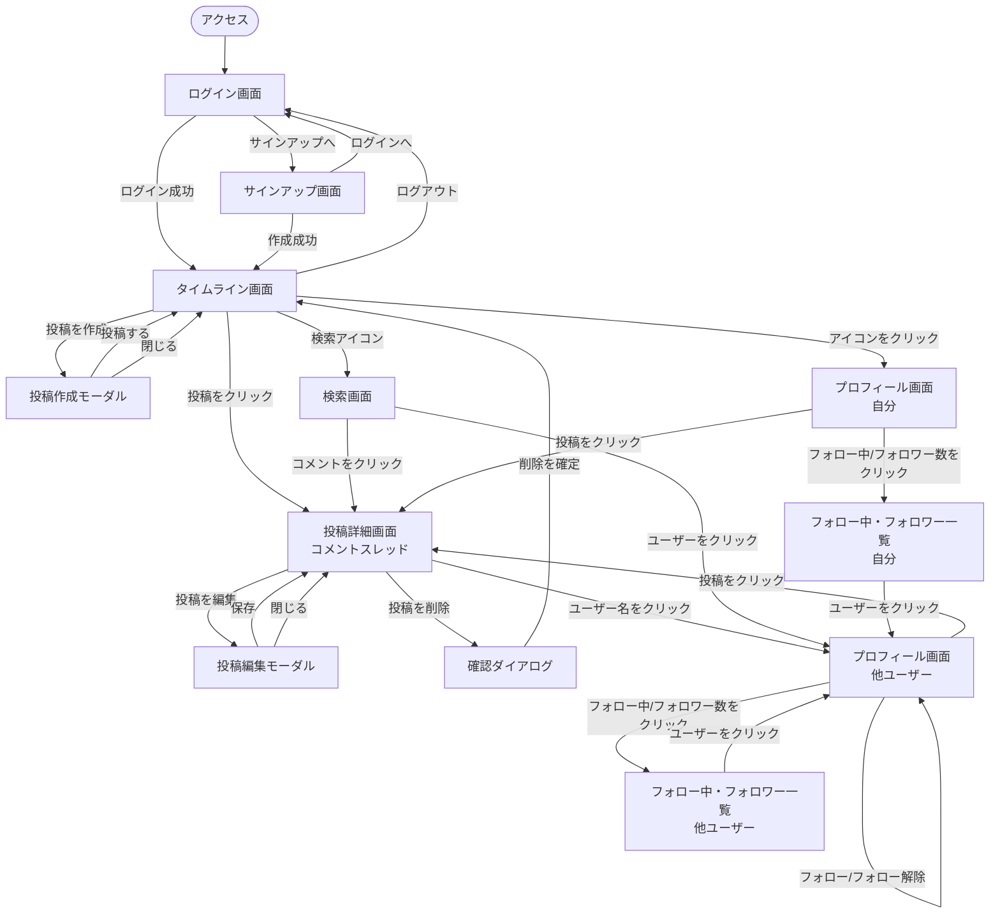
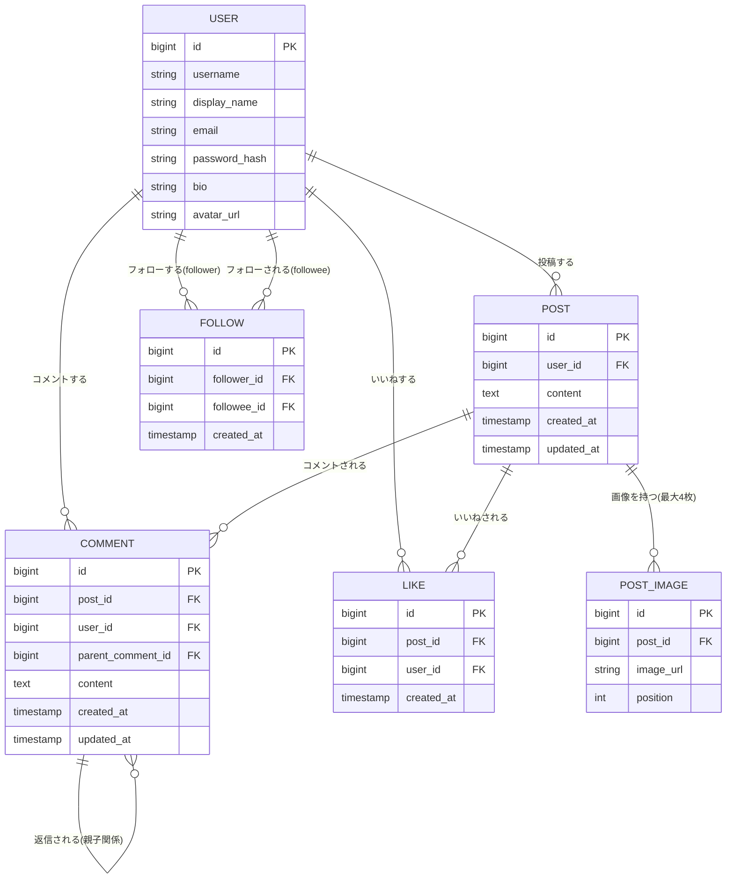

# Murmur 要件定義書

## 目次

- [1. 概要・目的](#1-概要目的)
- [2. 想定利用者・利用シーン](#2-想定利用者利用シーン)
- [3. 機能要件](#3-機能要件)
  - [3.1 認証](#31-認証)
  - [3.2 フォロー](#32-フォロー)
  - [3.3 タイムライン](#33-タイムライン)
  - [3.4 投稿](#34-投稿)
  - [3.5 コメント](#35-コメント)
  - [3.6 いいね](#36-いいね)
  - [3.7 検索](#37-検索)
  - [3.8 プロフィール](#38-プロフィール)
- [4. 非機能要件](#4-非機能要件)
- [5. 画面一覧・画面遷移(案)](#5-画面一覧画面遷移案)
  - [5.1 画面遷移図](#51-画面遷移図)
- [6. データ項目(案)](#6-データ項目案)
  - [6.1 ER図(案)](#61-er図案)
- [7. スコープ外・将来拡張](#7-スコープ外将来拡張)
- [8. 今後の進め方(提案)](#8-今後の進め方提案)

---

## 1. 概要・目的

本アプリケーションは、X（旧Twitter）のようなタイムライン形式の短文投稿SNSである。

学習課題として、個人利用のSNSアプリケーションとして開発する。ただし実際の利用者は自分のみだが、
サインアップ機能を備え「複数ユーザーが使う」ことを前提に設計する。これにより、いいね・コメントを
自分以外のユーザーが行うケースを踏まえた件数表示・データモデルを検討する。

X/Twitterとの主な違いとして、インプレッション数の表示は行わず、リツイート（リポスト）に相当する
機能も用意しない。

技術スタックはバックエンド：Java 25（LTS）/ Spring Boot 4.1.x / Gradle、フロントエンド：
React（Vite + TypeScript）、データベース：PostgreSQL。詳細・選定理由は
[基本設計書](basic-design.md)を参照。

## 2. 想定利用者・利用シーン

| 項目 | 内容 |
|------|------|
| 主な利用者 | 個人（自分自身の利用がメイン） |
| 想定するユーザー数 | サインアップ機能により複数ユーザーが存在しうる設計とするが、実運用は自分のみを想定 |
| 利用シーン | 短文投稿によるタイムライン閲覧、フォローしたユーザーの投稿へのいいね・コメント |

## 3. 機能要件

◎＝必須（MVP） ／ ○＝あると良い（後回し可） ／ △＝任意（発展課題）

### 3.1 認証

| 機能 | 優先度 | 内容 |
|------|--------|------|
| サインアップ | ◎ | ユーザー名・メールアドレス・パスワードでアカウントを作成できる |
| ログイン・ログアウト | ◎ | 作成したアカウントでログイン・ログアウトできる |
| パスワードリセット | △ | メール経由でのパスワード再設定（発展課題） |

### 3.2 フォロー

| 機能 | 優先度 | 内容 |
|------|--------|------|
| フォロー・フォロー解除 | ◎ | 他ユーザーをフォロー／フォロー解除できる |
| フォロー中・フォロワー一覧 | ◎ | 自分・他ユーザーのフォロー中一覧／フォロワー一覧を表示できる |
| フォロー中・フォロワー数の表示 | ◎ | プロフィール画面に件数を表示する |

### 3.3 タイムライン

| 機能 | 優先度 | 内容 |
|------|--------|------|
| フォロー中ユーザーの投稿表示 | ◎ | 自分がフォローしているユーザー（＋自分自身）の投稿を新着順に時系列表示する |
| 全体タイムラインの表示 | ○ | フォロー有無に関わらず、全ユーザーの投稿を新着順に表示する。「フォロー中」表示と切り替えられる |
| 無限スクロール・ページネーション | ○ | 投稿数が増えた際の表示方法（後回し可） |

### 3.4 投稿

| 機能 | 優先度 | 内容 |
|------|--------|------|
| テキスト投稿 | ◎ | 短文テキストを投稿できる（文字数上限は基本設計書で定義） |
| 画像投稿 | ◎ | 1投稿につき画像を最大4枚まで添付できる |
| 投稿の編集 | ◎ | 自分の投稿のテキスト・画像を編集できる |
| 投稿の削除 | ◎ | 自分の投稿を削除できる。削除するとコメント・いいねも合わせて表示されなくなる |

### 3.5 コメント

| 機能 | 優先度 | 内容 |
|------|--------|------|
| 投稿へのコメント | ◎ | 投稿に対してコメントを付けられる |
| コメントへの返信（返信先表示） | ◎ | コメントに対して返信ができる。コメント一覧は時系列のフラット表示とし、返信の場合は「誰への返信か」を表示する（X/Twitterのリプライ形式。ネストしたツリー表示は行わない） |
| コメント数の表示 | ◎ | 投稿に対する合計コメント数（返信含む）を表示する |
| コメントの編集・削除 | ◎ | 自分のコメント・返信の編集・削除ができる。返信を持つコメントを削除した場合は論理削除とし、「削除済みのコメントです」と表示しつつ、そのコメントへの返信からの参照は維持する |

### 3.6 いいね

| 機能 | 優先度 | 内容 |
|------|--------|------|
| いいね・いいね解除 | ◎ | 投稿に対していいね／解除ができる |
| いいね数の表示 | ◎ | 投稿ごとのいいね数を表示する。自分以外のユーザーによるいいねも件数に反映される想定 |

### 3.7 検索

| 機能 | 優先度 | 内容 |
|------|--------|------|
| ユーザー検索 | ◎ | ユーザー名・表示名でユーザーを検索できる |
| コメント検索 | ◎ | コメント本文をキーワードで検索できる |
| 投稿検索 | ○ | 投稿本文の検索（後回し可、将来拡張） |

### 3.8 プロフィール

| 機能 | 優先度 | 内容 |
|------|--------|------|
| プロフィール編集 | ◎ | 自分の表示名・自己紹介・アイコン画像を編集できる |

## 4. 非機能要件

| 分類 | 要件 |
|------|------|
| 対応環境 | 主要モダンブラウザ（Chrome, Edge, Safari 最新版）を想定 |
| レスポンシブ対応 | PCでの利用をメインとしつつ、タブレット幅程度までは崩れないレイアウトとする |
| 画像アップロード | 1画像あたりのファイルサイズ・形式（jpg/png等）の上限は基本設計書で定義する |
| データ永続化 | ページ再読み込み・再訪問後もデータが失われないこと |
| パフォーマンス | 投稿・コメント数百〜数千件程度までは操作にストレスがないこと |
| 保守性 | 学習課題のため、コンポーネント・レイヤー単位で分かりやすく分割されたコードとする |

## 5. 画面一覧・画面遷移(案)

| 画面名 | 概要 |
|--------|------|
| ログイン画面 | メールアドレス・パスワードでログインする |
| サインアップ画面 | ユーザー名・メールアドレス・パスワードでアカウントを作成する |
| タイムライン画面 | フォロー中ユーザー（＋自分）の投稿を時系列表示するメイン画面。投稿作成への導線を持つ |
| 投稿作成・編集モーダル | テキスト入力・画像添付（最大4枚）を行う共通UI。編集時は既存内容を初期表示する |
| 投稿詳細画面 | 投稿本文・画像に加え、コメントスレッド（階層構造）を表示する |
| プロフィール画面（自分/他人） | ユーザー情報、投稿一覧、フォロー中・フォロワー数を表示する。他人のプロフィールではフォローボタンを、自分のプロフィールでは編集ボタン（表示名・自己紹介・アイコン画像を編集）を表示する |
| フォロー中・フォロワー一覧画面 | 指定ユーザーのフォロー中一覧／フォロワー一覧を表示する |
| 検索画面 | ユーザー検索・コメント検索を切り替えて実行できる |
| 確認ダイアログ | 投稿・コメントの削除など取り消しづらい操作の実行前に確認を求める共通ダイアログ |

### 5.1 画面遷移図

- 投稿作成・編集モーダル、確認ダイアログは現在のビュー上に重なる形（画面遷移を伴わない）で表示する想定。

## 6. データ項目(案)

主キーはDB側の自動採番とする。

### User（ユーザー）
| 項目 | 内容 |
|------|------|
| id | 主キー |
| username | ログイン・検索に使うユーザー名（一意） |
| display_name | 表示名 |
| email | メールアドレス（一意） |
| password_hash | ハッシュ化したパスワード |
| bio | 自己紹介 |
| avatar_url | アイコン画像URL |

### Post（投稿）
| 項目 | 内容 |
|------|------|
| id | 主キー |
| user_id | 投稿したユーザー（User） |
| content | 投稿本文 |
| created_at / updated_at | 作成日時・更新日時（編集時に更新） |

### PostImage（投稿画像）
| 項目 | 内容 |
|------|------|
| id | 主キー |
| post_id | 紐づく投稿（Post） |
| image_url | 画像URL（クラウドオブジェクトストレージ上のパス） |
| position | 投稿内での表示順（最大4枚） |

### Comment（コメント）
| 項目 | 内容 |
|------|------|
| id | 主キー |
| post_id | 紐づく投稿（Post） |
| user_id | コメントしたユーザー（User） |
| parent_comment_id | 返信先のコメント（自己参照、トップレベルコメントはNULL） |
| content | コメント本文 |
| created_at / updated_at | 作成日時・更新日時 |

### Like（いいね）
| 項目 | 内容 |
|------|------|
| id | 主キー |
| post_id | 対象の投稿（Post） |
| user_id | いいねしたユーザー（User） |
| created_at | いいねした日時（同一ユーザー・同一投稿の組は一意） |

### Follow（フォロー）
| 項目 | 内容 |
|------|------|
| id | 主キー |
| follower_id | フォローする側のユーザー（User） |
| followee_id | フォローされる側のユーザー（User）（follower_idとの組は一意） |
| created_at | フォローした日時 |

### 6.1 ER図(案)

テーブルの型・制約の確定版は[基本設計書 3章](basic-design.md#3-db物理設計)を参照。

## 7. スコープ外・将来拡張

- インプレッション数（閲覧数）の表示は行わない
- リツイート・リポストに相当する機能は用意しない
- 投稿検索、コメントの編集・削除、パスワードリセットは本版では優先度を下げ、将来拡張として扱う
- ダイレクトメッセージ、通知機能は本要件定義書のスコープ外とする

## 8. 今後の進め方（提案）

1. 本要件定義書の内容をレビューし、優先度（◎/○/△）を確定する
2. 技術スタックの詳細・DB物理設計・API設計を確定する（[基本設計書](basic-design.md)）
3. 画面設計（ワイヤーフレーム）を行う
4. インフラ構成（クラウドオブジェクトストレージの具体プロバイダ、ロードバランサー構成等）を検討し、`docs/infrastructure.md`として別途整備する
5. MVP（◎項目）から実装を開始する
